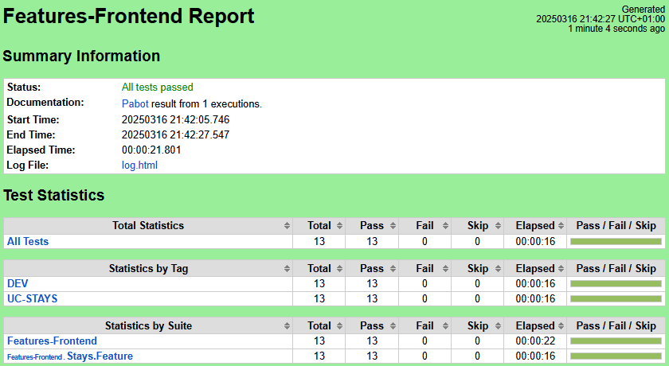

 # :fallen_leaf: :leaves: Testinium-BookingApp :leaves: :fallen_leaf:

## 📌 Project Description
This project automates the testing process for the https://www.Booking.com site using **Python**, **Robot Framework** and **Cucumber (BDD)**. The automation suite is integrated with **Gitlab Actions CI/CD** for continuous testing and runs in an isolated **Docker** environment. Test case management and reporting are handled via **Jira Xray**.


## 🎯 Objectives
- Automate functional and regression testing
- Reduce manual testing effort and execution time
- Enable early bug detection and faster feedback loops
- Integrate automated tests into CI/CD pipeline
- Manage test cases and reports efficiently with **Jira Xray**


## 🛠️ Tech Stack

<p align="left"> 
<a href="https://www.python.org/" target="_blank" rel="noreferrer"> 
     
</a> 

<a href="https://robotframework.org/" target="_blank" rel="noreferrer">
     
</a>    

<a href="https://www.oracle.com/" target="_blank" rel="noreferrer"> 
   
</a>

<a href="https://about.gitlab.com/" target="_blank" rel="noreferrer">
     
</a>

<a href="https://www.docker.com/" target="_blank" rel="noreferrer">
     
</a> 

<a href="https://projectfactory.randstaddigital.fr/secure/AboutPage.jspa" target="_blank" rel="noreferrer">
     
</a>

<a href="https://www.getxray.app/" target="_blank" rel="noreferrer">
     
</a>

</p>

- **Programming Language:** Python
- **Test Framework:** Robot Framework
- **Behavior-Driven Development (BDD):** Cucumber (Gherkin syntax)
- **Continuous Integration & Deployment (CI/CD):** Gitlab
- **Containerization:** Docker
- **Test Management:** Jira & Xray


## 🚀 How to Run the Tests
### 1️⃣ Clone the repository
```bash
git clone https://github.com/your-username/booking-automation.git
cd booking-automation
```
##### Manually :

Fork / Clone repository from [here](https://github.com/BalamiRR/Testinium-Booking.git) or download zip and set
it up in your local workspace.

### 2️⃣ Install dependencies
```bash
pip install -r requirements.txt
```
### 3️⃣ Run tests locally
```bash
> robot --outputdir results --variable BROWSER:chrome --variable ENVIRONMENT:DEV features-frontend/stays.feature.robot
```
###  Develop automation scripts using BDD approach
Develop automation scripts using the BDD approach in Robot Framework.
There are already many predefined keywords which are packaged under /step_definition/frontend/stays.steps.robot, helping speed up your automation development with essential workaday helper methods.

Tests are written using the Robot Framework with the Gherkin Syntax. Here is one of the scenarios:
Feature File (Python Robot Framework)

##### Feature File (stays.feature.robot)
The feature file defines the test cases using the Gherkin syntax in Behavior-Driven Development (BDD). It describes scenarios in a human-readable format, ensuring clarity for both technical and non-technical stakeholders.

Here is the feature file for UC-STAYS, where we define the test cases:
```
*** Settings ***
Resource    ../step-definition/frontend/stays.steps.robot
Force Tags    UC-STAYS

*** Test Cases ***
Scenario: Select minimum number of children
    [Documentation]    
    ...    This scenario verifies that when the "+" button for children is clicked, the 
    ...    number of children increases by 1 and the "Age needed" field appears.
    [Tags]    Medium
    Given I see "0" displayed default for children
    When I click the '+' button for children
    Then I see the number of children increase by 1
    And I see the "Age needed" field is displayed for the added child
    
Scenario: Select a random age needed for children
    [Documentation]    
    ...    This scenario verifies that when the "+" button for children is clicked, the number
    ...    of children increases by 1 and the "Age needed" field appears.
    [Tags]    Medium
    Given I click the "Age needed" field
    Then I will see the list of ages 
    When I select a random age from the list
    Then The age will be assigned to the field
    When I click the Done button
    Then I see the selected number of "1" is displayed in the field
```
##### Step Definitions (stays.steps.robot)
The Step Definitions file connects the feature file’s Gherkin steps to actual automation code, enabling test execution.

Here’s an example Step Definition file :
```
*** Settings ***
Library    SeleniumLibrary
Library    DateTime
Resource    home.steps.robot
Resource    pages/webdrivers.robot
Variables    webelements.py

*** Keywords ***

I click the "Age needed" field
    Click Element    ${AGE_NEEDED_FIELD}

I will see the list of ages 
    Element Should Be Visible    ${AGE_NEEDED_LIST}

I select a random age from the list
    ${options}    Get List Items    ${AGE_NEEDED_FIELD}
    ${random_age}    Evaluate    random.choice(${options})    modules=random
    Select From List By Label    ${AGE_NEEDED_FIELD}    ${random_age}
    Log    ${AGE_NEEDED_FIELD}
    Log    ${random_age}

The age will be assigned to the field
    ${age_value}    Get Value    ${AGE_NEEDED_FIELD}

I click the Done button
    Click ELement    ${DONE_BTN}

I see the selected number of "${children}" is displayed in the field
    ${children_value}    Evaluate    ${children_value} + 1
    ${children}    Convert To Integer    ${children}
    Should Be Equal    ${children_value}    ${children}
```

### 📌 GitLab Pipeline Execution Summary
In our GitLab CI/CD pipeline, we regularly run automated tests to ensure software quality. In this process, we encountered two different test execution outcomes:

#### 🔴 Failed Pipeline Execution
* In the first execution, 10 out of 13 tests passed, while 3 tests failed.
* The failed tests indicate potential system issues or missing functionalities.
* Test Report Screenshot:


* This report provides insights into which tests failed and detailed error logs for further analysis.

#### ✅Successful Pipeline Execution
* After fixing the identified issues, all tests passed (13/13).
* This confirms that the fixes were effective and the system is functioning as expected.
* Test Report Screenshot:



#### GitLab Pipeline Result
* Successful pipeline execution screenshot:
* This shows that the tests were executed successfully within the GitLab pipeline and passed the sanity frontend stage.


### 📌Jira Xray 

#### Test Plan and Test Execution Overview
We track our test execution results using Jira Xray, ensuring better test management and defect tracking.  **Test Plan** is created to manage the testing process. The Test Plan includes the test scenarios that need to be executed, and these are run through the **Test Execution** process.

In this example, there are 28 tests in total, out of which 22 have passed and 6 are still to be executed. Each test case has details like the assignee, number of executions, dataset used, and the latest status.

#### 📌Test Case
The image shows a detailed test case written in Cucumber (Gherkin) format. This test verifies that users can correctly select the number of travelers and choose the appropriate flight class on the booking platform.


## 📄 License
This project is licensed under the MIT License.


# FUAT AND FURKAN KARA
